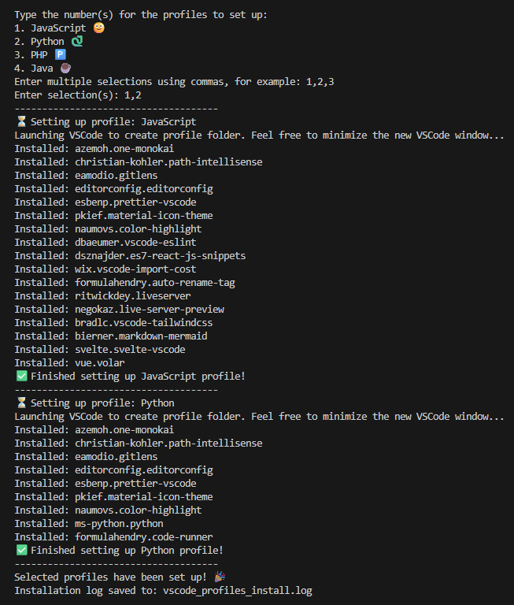

# VSCode Profiles & Extensions Installer
A helper script to quickly set up VSCode profiles with preferred extensions.  

## Features
- Creates VSCode profiles: JavaScript, Python, PHP, Java
- Installs common extensions for all profiles
- Installs profile-specific extensions for the selected profile
- Saves an installation log to `vscode_profiles_install.log`
- Extensions list is easy to customize

## How it Works
- For each selected profile, the script launches a new VSCode window to create the profile folder and default settings.
  - You can minimize the window until setup completes.
- Installs common extensions for all profiles.
- Installs profile-specific extensions for the chosen profile.
- Logs all installed extensions to `vscode_profiles_install.log`.

## Screenshot

## Installation
- Fork this repository to your own GitHub account.
- Clone your fork onto your local device.
- Open a terminal window in the project folder
- Make the script file executable: `chmod +x vscode_profiles_setup.sh`
- Run the file: `./vscode_profiles_setup.sh`
- Sit back and relax while your profiles are set up with your preferred extensions! 😎